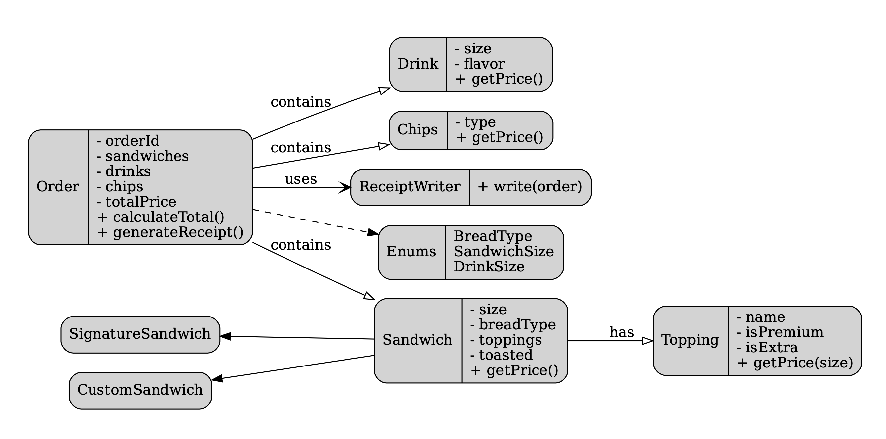
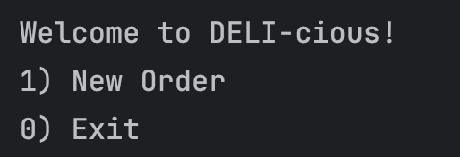
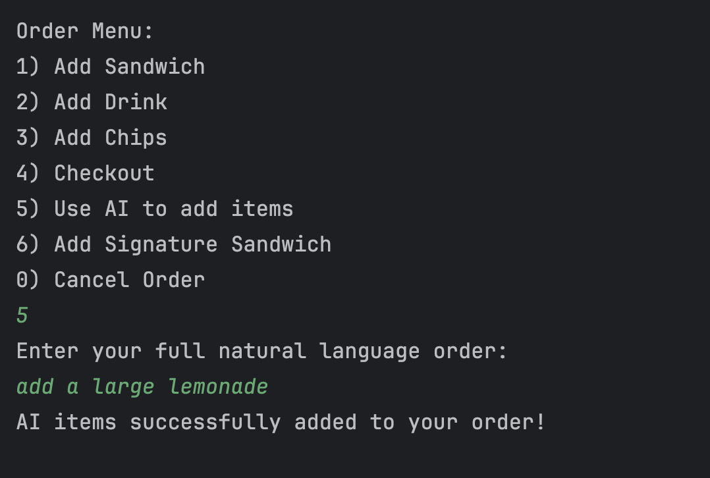
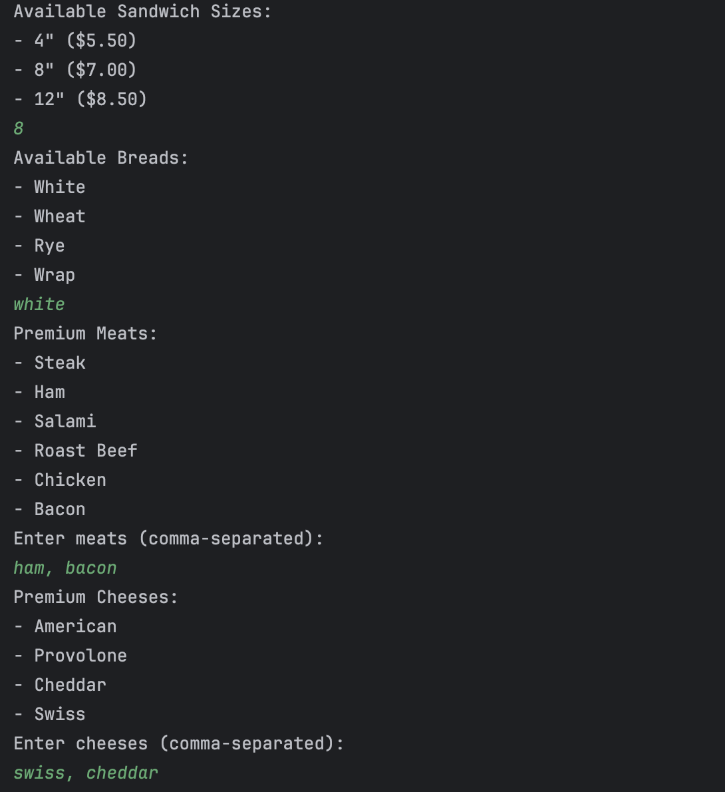
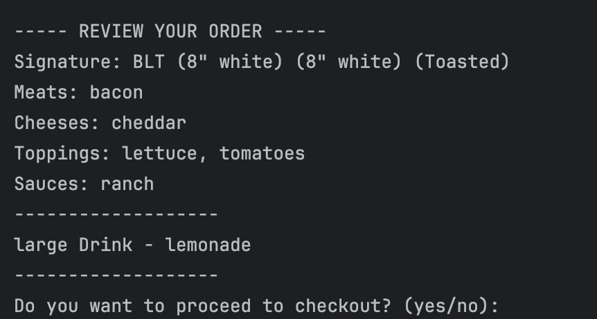
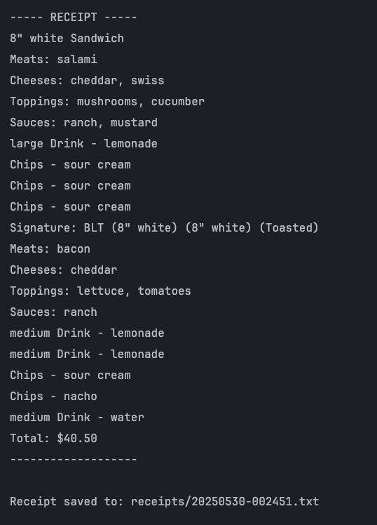

# DELI-cious - Custom Sandwich Shop CLI

**DELI-cious** is a Java-based command-line application that simulates a full sandwich shop ordering experience. Customers can build custom sandwiches, add drinks and chips, and even use AI to place orders in natural language.

## 💾 Features

- Fully customizable sandwiches (bread, size, meats, cheeses, toppings, sauces, toasted)
- AI-powered ordering with OpenAI (e.g., “Can I get a BLT with lemonade?”)
- Signature sandwiches (BLT, Philly Cheese Steak, or save your own!)
- Add drinks and chips to your order
- Full order review before checkout
- Receipt generation and file saving (named by date/time)
- Persistent custom signature sandwiches via `signatures.json`

## Demo Screenshots


### 💻 Main Menu

```
Welcome to DELI-cious!
1) New Order
0) Exit
```

### 💾 Order Menu

```
Order Menu:
1) Add Sandwich
2) Add Drink
3) Add Chips
4) Checkout
5) Use AI to add items
6) Add Signature Sandwich
0) Cancel Order
5
Enter your full natural lanquage order:
add a large lemonade
AI items successfully added to vour order!
```
### 💾 Custom Sandwich Options/Window

```
Available Sandwich Sizes:
4" ($5.50)
- 8" ($7.00)
• 12" ($8.50)
8
Available Breads:
• White
- Wheat
Rve
• Wrao
white
Premium Meats:
Steak
Ham
- Salami
• Roast Beef
Chicken
- Bacon
Enter meats (comma-separated):
ham, bacon
Premium Cheeses:
American
- Provolone
Cheddar
• Swiss
Enter cheeses (comma-separated):
swiss, cheddar
```

### 💾 AI Order Example

```
Enter your full natural language order:
> Can i get a blt with a large lemonade?

AI items successfully added to your order!
```

### 💾 Check Out Screen Example

```
REVIEW YOUR ORDER
Signature: BLT (8" white) (8" white) (Toasted)
Meats: bacon
Cheeses: cheddar
Toppings: lettuce, tomatoes
Sauces: ranch
large Drink - lemonade
Do you want to proceed to checkout? (yes/no):

```

### 💾 Receipt Output


```
----- RECEIPT -----
8" white Sandwich
Meats: salami
Cheeses: cheddar, swiss
Toppings: mushrooms, cucumber
Sauces: ranch, mustard
large Drink
lemonade
Chips - sour cream
Chips - sour cream
Chips - sour cream
Signature: BLT (8" white) (8" white) (Toasted)
Meats: bacon
Cheeses: cheddar
Toppings: lettuce, tomatoes
Sauces: ranch
medium Drink - Lemonade
medium Drink - Lemonade
Chips - sour cream
Chips - nacho
medium Drink - water
Total: $40.50
Receipt saved to: receipts/20250530-002451.txt
```


## 📁 Folder Structure

- `Main.java` — Entry point and menu system
- `Sandwich.java`, `Drink.java`, `Chips.java` — Core order item classes
- `SignatureSandwich.java`, `BLT.java`, `PhillyCheeseSteak.java` — Predefined sandwiches
- `MenuService.java` — Prints options, manages saved custom sandwiches
- `OpenAIClient.java` — Handles GPT interaction for natural language ordering
- `signatures.json` — Stores saved custom sandwiches
- `receipts/` — Receipt files saved per order

##  Highlight: AI Order Integration

The AI ordering feature uses `OpenAIClient.java` to convert natural language into structured JSON, which is then parsed into actual Java objects and added to the user's order.

Example input:
```text
can i get a blt with a large lemonade?
```

Is interpreted as:
```json
{
  "sandwiches": [
    {
      "type": "BLT",
      "size": "8",
      "bread": "white",
      "toasted": true
    }
  ],
  "drinks": [
    {
      "flavor": "lemonade",
      "size": "large"
    }
  ],
  "chips": []
}

```

## 🧑‍🏫 Created By

Isaac Avila
[Pluralsight Capstone 2 — Advanced Java OOP]

## 📜 License

This project is for educational use only.
